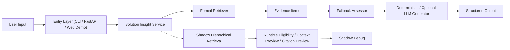

# AI Solution Sales Insight Agent

AI Solution Sales Insight Agent is a local-first AI Agent prototype for analyzing business requirements, retrieving solution evidence, generating AI opportunity insights, and supporting human evaluation workflows.

It combines deterministic demo mode, formal retrieval, enterprise context providers, shadow retrieval diagnostics, observability reports, and human review tools into a lightweight FastAPI-based MVP.

## 1. Project Overview

这个项目把 AI 解决方案分析拆成一条更可审计的工程链路：输入业务场景，检索正式证据，生成结构化洞察，在证据不足或边界不清时主动触发 fallback 和人工确认。

仓库当前提供的是一个可运行、可验证、可演示的 local-first MVP，而不是完整生产 SaaS。

## 2. What It Does

项目聚焦于 AI 解决方案 / 售前 / 咨询类场景中最常见的几个问题：

- 业务需求、事实、假设和建议混在一起
- 推荐方案缺少清晰证据来源
- 检索结果可能越过方案边界
- 模型在证据不足时仍然容易“补全”事实
- 很难把失败和不确定性明确暴露给人工复核

对应地，当前系统会输出：

- requirement summary
- pain points
- AI opportunity points
- proposed solution direction
- evidence items
- evidence completeness status
- fallback recommendation
- human confirmation hint
- optional shadow retrieval diagnostics

## 3. Demo Preview

当前仓库已经具备三个本地入口：

- CLI：`python run.py solution-insight ...`
- FastAPI：`POST /solution-insight`
- Web Demo：`GET /demo`

如果还没有补充截图资源，可以先按照 [Screenshot and Demo Guide](docs/SCREENSHOT_AND_DEMO_GUIDE.md) 生成：

- `docs/assets/web-demo-home.png`
- `docs/assets/web-demo-result.png`
- `docs/assets/human-review-case.png`

## 4. Core Capabilities

1. Solution Insight Agent Service
2. Formal Retrieval Benchmark v2
3. Shadow Hierarchical Retrieval Debug
4. Deterministic Demo Mode
5. Fallback / Human Confirmation
6. Skills Registry
7. Context Provider Interface
8. MCP-style Enterprise Context Mock
9. Observability Snapshot and Report
10. Human Review UI
11. LLM Evaluation Harness

## 5. Architecture



关键约束：

- 正式 evidence 只来自 formal retriever
- shadow retrieval 只进入 debug，不影响正式回答
- fallback 用于控制证据不足和边界风险
- service 层把 retrieval、fallback、generation 和 debug 统一成一个清晰接口

详细说明见 [Architecture Overview](docs/ARCHITECTURE_OVERVIEW.md)，Mermaid 图源见 [architecture_diagram.mmd](docs/architecture_diagram.mmd)。

## 6. Quick Start

### 6.1 安装

```bash
python -m venv .venv
source .venv/bin/activate
pip install -r requirements.txt
```

### 6.2 运行测试

```bash
./.venv/bin/python -m pytest -q
./.venv/bin/python scripts/run_retrieval_benchmark_v2.py --check
```

### 6.3 CLI Usage

```bash
./.venv/bin/python run.py solution-insight \
  --query "一家中型 SaaS 公司想提升销售线索转化和客户成功效率" \
  --company-id demo_saas_001 \
  --industry "SaaS" \
  --shadow \
  --llm-mode deterministic
```

### 6.4 FastAPI 启动

```bash
uvicorn app.main:app --host 127.0.0.1 --port 8000
```

## 7. Web Demo

启动服务后访问：

```text
http://127.0.0.1:8000/demo
```

Landing page：

```text
http://127.0.0.1:8000/
```

说明：

- Portfolio-grade AI Agent prototype
- Deterministic mode by default
- Shadow retrieval does not affect the formal answer
- Fallback protects evidence and boundary risks

Web Demo 是一个轻量展示层：

- 左侧输入业务场景和企业上下文参数
- 右侧展示结构化结果、证据、fallback、context、skill trace 和 shadow debug
- 页面通过 `fetch` 调用现有 `/solution-insight` API，不改变后端契约

## 8. Human Review UI

仓库还提供一个轻量人工复核界面：

```text
http://127.0.0.1:8000/human-eval
```

当前 Human Review UI 用于：

- 浏览待评审 case
- 查看结构化输出
- 提交人工结论
- 汇总 review 进度

相关说明见 [Human Evaluation Guide](docs/HUMAN_EVALUATION_GUIDE.md)。

## 9. Evaluation

当前评测链路主要包括：

- Formal Retrieval Benchmark v2
- Retrieval failure diagnosis
- Boundary blind validation
- Candidate recall experiments
- Solution Insight LLM evaluation harness
- Human evaluation packet and summary

需要明确的是：

- 当前 formal retriever 尚未通过最终 blocking gate
- formal retrieval benchmark 指标不是 agent 端到端准确率
- deterministic mode 用于保证本地 demo 可复现，不代表真实 LLM 最终质量

关键结果与说明见：

- [Retrieval Benchmark V2 Results](docs/27_Retrieval_Benchmark_V2_Results.md)
- [LLM Model Comparison Report](docs/LLM_MODEL_COMPARISON_REPORT.md)
- [V0.3 Release Notes](docs/V0_3_RELEASE_NOTES.md)

## 10. Observability

项目提供一个本地只读 observability demo，用于把一次请求中的：

- formal retrieval path
- shadow retrieval path
- enterprise context trace
- skill trace
- fallback assessment

整合成统一 snapshot 和 Markdown report。

运行方式：

```bash
./.venv/bin/python scripts/run_solution_insight_observability_demo.py
./.venv/bin/python scripts/run_solution_insight_observability_demo.py --write
./.venv/bin/python scripts/run_solution_insight_observability_demo.py --check
```

输出示例：

- `data/observability/latest_solution_insight_snapshot.json`
- `data/observability/latest_solution_insight_report.md`

这是一套本地工程观测工具，不是生产监控系统。

## 11. Limitations

当前项目的已知限制包括：

- formal retriever 还没有通过最终 blocking gate
- boundary blind validation 结果仍为 blocked_with_known_limitations
- hierarchical retrieval 目前只在 shadow/debug 中运行
- deterministic mode 适合演示和测试，不等于生产生成质量
- 当前没有复杂前端、鉴权、多租户或生产级部署方案

## 12. Roadmap

下一阶段如果继续推进，优先级通常会放在：

1. 更稳定的 Web Demo 与可视化观测
2. 更完整的人工复核闭环
3. 更清晰的部署与运行手册
4. 更严格的 LLM 输出评测和人工评分
5. 更真实的企业系统上下文接入

补充文档：

- [Project Walkthrough](docs/PROJECT_WALKTHROUGH.md)
- [Demo Script](docs/DEMO_SCRIPT.md)
- [Deployment Guide](docs/DEPLOYMENT.md)
- [GitHub Agent Project Benchmark](docs/GITHUB_AGENT_PROJECT_BENCHMARK.md)
