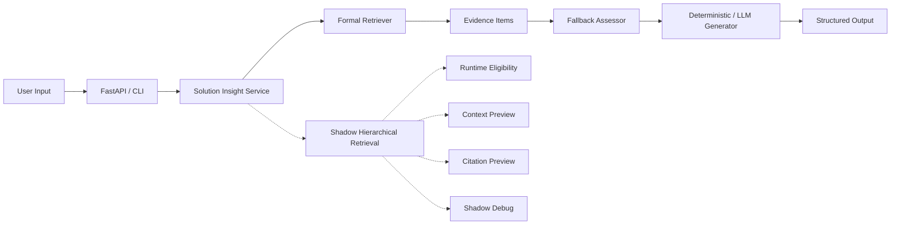

# AI Solution Sales Insight Agent

面向 AI 解决方案 / 售前 / 咨询场景的业务需求分析 Agent，用于从客户需求中生成结构化 AI 方案洞察，并通过 RAG 检索证据和 fallback 机制控制风险。

这个仓库展示的是一个可审计、可解释、可演示的 portfolio-grade prototype，而不是一个已经完全生产化的系统。

## 1. Project Overview

这个项目把销售分析从“一次性生成一整份大报告”改造成“可验证、可定位、可审计的节点式 Workflow”。

当前已经具备：

- Architecture C 的分节点 workflow
- Formal Retrieval Benchmark v2
- 纯代码 Deal Score
- Final Validation 与 Human Review
- Solution Insight Agent Service
- Skills Registry v0.2
- MCP-style Mock Context
- Context Provider Interface v0.3
- CLI 与最小 FastAPI 包装层
- deterministic demo mode
- shadow retrieval debug mode

## 2. What Problem It Solves

企业售前和 AI 咨询场景里，最常见的问题不是“没输出”，而是“输出看起来对，但无法证明对”。

这个项目主要解决：

- 客户需求、痛点和事实混在一起
- 销售把积极联系人误判成决策人
- 方案推荐超出候选边界
- Deal Score 不可解释
- 整份报告只能最后才发现错误
- 很难给出可追踪、可复核、可回放的证据链

## 3. Key Features

1. Formal Retrieval Benchmark v2
2. RAG / Retriever / Runtime Filter
3. Boundary Blind Validation
4. Candidate Recall Round 2
5. Feature Flag Shadow Retrieval
6. Solution Insight Agent Service
7. Skills Registry v0.2 + skill trace
8. MCP-style Mock Context
9. CLI + FastAPI wrapper
10. deterministic mode
11. fallback / human confirmation
12. 结构化日志与可审计留痕

## 4. Architecture



正式路径和 shadow 路径是隔离的：

- 正式 evidence 只来自 formal retriever
- shadow 只进入 debug，不影响正式回答
- fallback 用于保护边界风险和证据不足场景
- service 内部已通过轻量 skills 编排 Requirement / Retrieval / Fallback / Generation

更多架构细节见 [Architecture Overview](docs/ARCHITECTURE_OVERVIEW.md)，可维护的 Mermaid 图源见 [architecture_diagram.mmd](docs/architecture_diagram.mmd)。

## 5. Quick Start

### 5.1 安装

```bash
python -m venv .venv
source .venv/bin/activate
pip install -r requirements.txt
```

### 5.2 运行测试

```bash
python -m pytest -q
python scripts/run_retrieval_benchmark_v2.py --check
python scripts/run_solution_insight_llm_eval.py --check
python scripts/run_solution_insight_llm_eval.py --comparison-check
```

### 5.3 CLI 示例

```bash
python run.py solution-insight \
  --query "一家中型 SaaS 公司想提升销售线索转化和客户成功效率" \
  --company-id demo_saas_001 \
  --industry "SaaS" \
  --shadow \
  --llm-mode deterministic
```

### 5.4 FastAPI 启动

```bash
uvicorn app.main:app --host 0.0.0.0 --port 8000
```

### 5.5 Health Check

```bash
curl http://localhost:8000/health
```

### 5.6 POST 示例

```bash
curl -X POST http://localhost:8000/solution-insight \
  -H "Content-Type: application/json" \
  -d '{
    "user_query": "一家中型 SaaS 公司想提升销售线索转化和客户成功效率",
    "company_id": "demo_saas_001",
    "industry": "SaaS",
    "company_size": "中型",
    "current_systems": ["CRM", "客服系统"],
    "target_goal": "提升转化和客户成功效率",
    "constraints": ["不改变现有CRM主流程"],
    "enable_shadow_retrieval": true,
    "llm_mode": "deterministic"
  }'
```

## 6. CLI Usage

CLI 会输出结构化 JSON，适合本地 demo、调试和面试展示。

```bash
python run.py solution-insight --help
```

常用参数：

- `--query`
- `--industry`
- `--company-size`
- `--current-system`
- `--target-goal`
- `--constraint`
- `--shadow`
- `--llm-mode deterministic|auto`

## 7. FastAPI Usage

FastAPI 提供两个路由：

- `GET /health`
- `POST /solution-insight`

响应直接复用 `agent.solution_insight_service` 的结构化输出。

## 8. Example Output

输出包含：

- 需求摘要
- 业务痛点
- AI 机会点
- 推荐方案方向
- 检索到的证据
- 证据完整性状态
- fallback / 人工确认建议
- 可选 shadow retrieval debug

## 8.1 Observability Demo

项目现在还提供一个只读的本地观测视图，用来把一次请求的：

- formal retrieval path
- shadow retrieval path
- skill trace
- enterprise context provider trace
- fallback assessment

整合成统一 snapshot 和 Markdown report。

运行方式：

```bash
python scripts/run_solution_insight_observability_demo.py
python scripts/run_solution_insight_observability_demo.py --write
python scripts/run_solution_insight_observability_demo.py --check
```

写入后会生成：

- `data/observability/latest_solution_insight_snapshot.json`
- `data/observability/latest_solution_insight_report.md`

这不是生产监控系统，而是一个 portfolio-grade debug report，适合 demo、录屏和本地排障。

## 9. Retrieval & Evaluation

项目已经完成：

- Retrieval v2 benchmark
- formal retrieval results 冻结
- candidate generation 与 recall round 2
- boundary blind validation
- retrieval v2 的结果冻结与分析

需要强调的是：

- 当前 formal retriever 尚未通过最终 blocking gate
- formal retrieval benchmark 的指标不是 agent 端到端准确率
- 当前结果只覆盖 6 个 Demo Solutions、20 份合成文档、40 个 Chunks 和 16 条 Cases

相关结果和结论见：

- [Retrieval Benchmark V2 Results](docs/27_Retrieval_Benchmark_V2_Results.md)
- [Retrieval Benchmark V2 Experiment Plan](docs/26_Retrieval_Benchmark_V2_Experiment_Plan.md)
- [Retrieval Benchmark V2 Failure Diagnosis](docs/28_Retrieval_V2_Failure_Diagnosis.md)

LLM 输出评测当前分为两层：

- deterministic baseline：冻结的 CI 合同
- provider comparison：可选真实模型横评，不覆盖 baseline

示例：

```bash
python scripts/run_solution_insight_llm_eval.py --providers deterministic,deepseek,qwen,glm
python scripts/run_solution_insight_llm_eval.py --providers deterministic,deepseek,qwen,glm --comparison-write
python scripts/run_solution_insight_llm_eval.py --comparison-check
```

更多说明见 [Model Selection and Evaluation](docs/MODEL_SELECTION_AND_EVALUATION.md) 和 [LLM Model Comparison Report](docs/LLM_MODEL_COMPARISON_REPORT.md)。

## 10. Shadow Hierarchical Retrieval

Shadow retrieval 已通过 feature flag 接入：

- `HIERARCHICAL_RETRIEVAL_MODE=off`
- `HIERARCHICAL_RETRIEVAL_MODE=shadow`

默认行为不会改变正式结果；shadow 只进入 debug。

## 11. Fallback / Safety Design

服务在以下场景会建议人工确认：

- 没有足够正式证据
- 证据全部被过滤
- 证据数量低于最低要求
- boundary 状态被阻塞或未知
- shadow 发现 parent-child gap
- retrieval error
- LLM error

输出会明确保留：

- fallback_recommended
- human_confirmation_required
- response_note

## 11.1 Skills Registry v0.2

当前 service 内部已经抽象出一组轻量 Skills：

- RequirementUnderstandingSkill
- EnterpriseContextSkill
- FormalRetrievalSkill
- ShadowRetrievalSkill
- FallbackAssessmentSkill
- SolutionGenerationSkill

它们由项目内的轻量 Skills Registry 编排，主要作用是：

- 让服务职责边界更清晰
- 为后续 MCP / tool 扩展预留接口
- 增加 `skill_trace` 便于调试和演示

这个 registry 不引入第三方 Agent 框架，也不会改变当前 CLI / FastAPI 的外部行为。

## 11.2 MCP-style Mock Context

当前项目已经补上一个本地 MCP-style Mock Context Layer，用于模拟未来企业上下文接入，但它仍然是：

- 本地 fixture
- 无网络
- 无真实 MCP SDK
- 无真实 CRM / Ticket / BI 后台

当前支持通过 `company_id` 读取 demo 企业上下文，例如：

- `demo_saas_001`
- `demo_ecommerce_001`
- `demo_manufacturing_001`

这部分上下文当前只进入可选 `enterprise_context` 和 `skill_trace`，不替代正式 evidence，也不强行改变正式 solution generation。

## 12. Project Status

当前项目已经完成：

- deterministic demo CLI
- FastAPI wrapper
- formal retrieval benchmark 冻结
- shadow retrieval debug
- service 级 fallback
- v0.3 Context Provider Interface

## 13. Limitations

这不是生产系统，当前限制包括：

- Boundary validation 仍然是 blocked_with_known_limitations
- hierarchical retrieval 目前只作为 shadow candidate pool
- deterministic mode 是可复现 demo，不代表真实 LLM 最终质量
- 当前没有复杂前端
- 当前不是生产部署完成态

## 14. Roadmap

下一阶段如果继续推进，优先顺序通常会是：

1. 更完善的产品化展示
2. 更清晰的部署与监控
3. 更完整的人工审批流
4. 进一步的企业集成

和同类开源项目的结构化对标见 [GitHub Agent Project Benchmark](docs/GITHUB_AGENT_PROJECT_BENCHMARK.md)。

## 15. Interview Highlights

最适合面试时强调的点：

- Formal benchmark 不是为了刷分，而是为了把边界讲清楚
- boundary blind validation 失败反而提升了工程可信度
- shadow retrieval 采用 feature flag 隔离，避免污染正式结果
- deterministic mode 让 demo 在无 API key 情况下仍可复现
- Service 层把 retrieval、fallback、LLM 和 debug 合并成一个清晰的产品接口

更多讲稿见 [Interview Talk Track](docs/INTERVIEW_TALK_TRACK.md) 和 [Demo Script](docs/DEMO_SCRIPT.md)。
