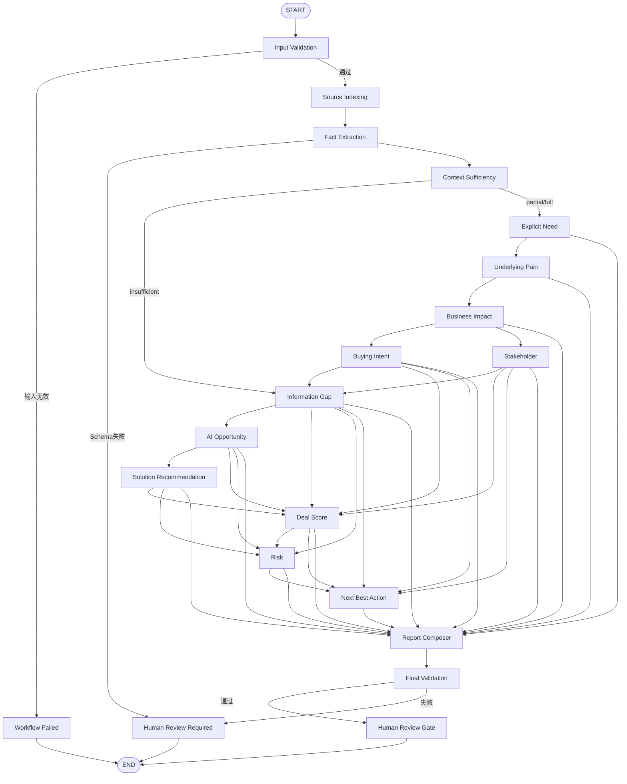
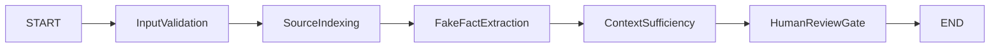

# AI Solution Sales Insight Agent

# Architecture C — Workflow State & Node Contract V1

## 1. Architecture C目标

Architecture C采用：

```text
Single Orchestrator
+
Deterministic Workflow
+
Node-level Pydantic Validation
+
Business Skills
+
Rule-based Components
+
Future RAG Integration
+
Human Review Gate
```

Architecture C解决的核心问题不是“让模型思考更多”，而是：

1. 将一次生成完整SalesInsightReport拆为多个可控任务；
2. 每个节点只负责一种业务判断；
3. 每个节点输出独立Pydantic模型；
4. 上一个节点校验成功后，下一个节点才可运行；
5. 节点失败时保存错误状态，不伪造完整报告；
6. 事实提取、业务推断、方案推荐和行动建议分离；
7. 最终由程序组装并校验SalesInsightReport；
8. 为后续Architecture D的Critic和定向修复保留接口。

---

## 2. Architecture C不包含的能力

本阶段不实现：

* 多Agent协作
* Critic Agent
* 自动反思
* 自动无限重试
* 节点失败后的自动字段补全
* 自动修改现有Schema
* 根据Hidden Reference Pack修改结果
* 根据DEV-01结果持续调Prompt
* 自动写CRM
* 自动发客户邮件
* 自动执行销售动作

Architecture C仍然是单Agent系统。

这里的“单Agent”表示：

* 共享一个Workflow State；
* 使用统一模型适配层；
* 由一个确定性Workflow控制节点；
* 各节点是业务Skill，不是独立自治Agent。

---

## 3. Workflow整体流程



---

## 4. 主流程解释

### 正常路径

```text
输入案例
→ 建立证据索引
→ 提取事实
→ 判断材料充分度
→ 识别显性需求
→ 推断潜在痛点
→ 判断业务影响
→ 判断购买意向
→ 分析决策链
→ 识别信息缺口
→ 判断AI机会
→ 推荐解决方案
→ 规则化Deal Score
→ 识别风险
→ 生成下一步行动
→ 组装报告
→ 最终Schema校验
→ 人工审核
```

### 信息不足路径

Context Sufficiency判断为`insufficient`时：

```text
事实提取
→ 信息缺口
→ 低置信度AI机会或insufficient_information
→ 风险
→ 信息收集类下一步行动
→ 报告
→ 人工审核
```

信息不足不是系统异常。

它是一种合法业务结果。

### 技术失败路径

以下情况属于技术或合同失败：

* 输入Schema失败
* LLM请求失败
* LLM返回非法JSON
* 节点输出无法通过Pydantic
* 节点缺少依赖
* 最终SalesInsightReport校验失败

技术失败时不继续生成伪造结果。

---

# 5. Workflow State设计

Architecture C使用两层State。

## 5.1 LangGraph运行时State

用于节点间增量更新。

建议使用：

```python
class ArchitectureCGraphState(TypedDict, total=False):
    ...
```

原因：

* LangGraph节点适合返回局部Patch；
* 节点不需要每次重建完整状态；
* 可以清晰控制每个节点允许写入的字段。

## 5.2 Pydantic State Snapshot

用于：

* 持久化
* 测试
* 调试
* 最终验收
* 节点运行前后完整状态校验

建议模型：

```python
ArchitectureCStateSnapshot
```

所有Graph State在需要保存或验收时转换为该模型。

---

## 6. Workflow State字段

### 6.1 运行标识

```text
run_id
case_id
architecture_version
workflow_version
schema_version
started_at
completed_at
workflow_status
current_node
```

### 6.2 配置与版本

```text
model_name
provider
prompt_versions
skill_versions
knowledge_base_version
git_commit
```

不得保存：

* API Key
* 完整认证信息
* Hidden Reference Pack

### 6.3 原始输入

```text
case_input
```

模型：

```python
EvaluationCaseInput
```

### 6.4 证据与事实层

```text
source_index
fact_extraction
context_sufficiency
```

### 6.5 业务分析层

```text
explicit_needs
underlying_pains
business_impacts
buying_intent
stakeholder_map
information_gaps
```

### 6.6 AI方案层

```text
ai_opportunities
retrieved_solutions
solution_recommendations
```

`retrieved_solutions`第一阶段允许为空，为后续RAG预留。

### 6.7 决策层

```text
deal_score
risks_and_objections
next_best_actions
```

### 6.8 报告层

```text
executive_summary
customer_followup
reliability_summary
evaluation_flags
final_report
```

### 6.9 执行状态

```text
node_records
failures
warnings
human_review_required
human_review_reasons
```

### 6.10 运行指标

```text
total_latency_ms
total_prompt_tokens
total_completion_tokens
total_tokens
node_metrics
```

---

# 7. 新增Workflow专用Pydantic模型

现有业务Schema不修改。

Architecture C新增Workflow专用模型。

## 7.1 WorkflowNodeName

枚举值：

```text
input_validation
source_indexing
fact_extraction
context_sufficiency
explicit_need
underlying_pain
business_impact
buying_intent
stakeholder
information_gap
ai_opportunity
solution_recommendation
deal_score
risk
next_best_action
report_composer
final_validation
human_review_gate
```

## 7.2 WorkflowStatus

```text
initialized
running
awaiting_human_review
completed
failed
```

## 7.3 NodeStatus

```text
pending
running
succeeded
failed
skipped
blocked
```

## 7.4 AnalysisMode

```text
full_analysis
partial_analysis
clarification_only
```

## 7.5 SourceIndexItem

字段：

```text
source_id
source_type
source_order
title
content
verified
```

示例：

```text
PROFILE-01
MTG-01
NOTE-01
CONSTRAINT-01
SOLUTION-01
```

## 7.6 SourceIndexResult

字段：

```text
items: list[SourceIndexItem]
source_count: int
```

## 7.7 ExtractedFact

字段：

```text
fact_id
category
statement
claim_type
confidence
evidence
```

要求：

* claim_type只能是fact或unknown；
* 销售备注不能在未验证时升级为客户事实；
* 每条fact必须有EvidenceReference。

## 7.8 FactExtractionResult

字段：

```text
facts
unknown_fields
customer_context_draft
```

其中：

```python
customer_context_draft: CustomerContext
```

## 7.9 ContextSufficiencyResult

字段：

```text
context_quality
analysis_mode
available_categories
missing_categories
blocking_gaps
reasoning_summary
```

使用现有：

```python
ContextQuality
```

## 7.10 NodeValidationIssue

字段：

```text
location
error_type
message
input_summary
```

不得保存完整敏感输入。

## 7.11 WorkflowFailure

字段：

```text
failure_id
node_name
failure_category
message
retryable
attempt
occurred_at
validation_issues
raw_artifact_path
```

`failure_category`建议枚举：

```text
input_validation
missing_dependency
llm_request
llm_response
json_parse
schema_validation
final_validation
internal_error
```

## 7.12 NodeExecutionRecord

字段：

```text
node_name
status
started_at
completed_at
latency_ms
prompt_version
model_name
usage
output_model
artifact_paths
failure_id
```

## 7.13 NodeExecutionResult

字段：

```text
node_name
status
state_patch
record
failure
```

`state_patch`只允许包含该节点声明的输出字段。

---

# 8. 节点统一协议

建议定义：

```python
class WorkflowNode(Protocol):
    name: WorkflowNodeName
    required_state_fields: tuple[str, ...]
    produced_state_fields: tuple[str, ...]
    output_model: type[BaseModel]

    def run(
        self,
        state: ArchitectureCGraphState,
        services: WorkflowServices,
    ) -> BaseModel:
        ...
```

统一执行器负责：

1. 检查依赖字段；
2. 标记节点为running；
3. 调用节点；
4. 使用`output_model.model_validate()`校验；
5. 只写入允许的State字段；
6. 记录延迟和Token；
7. 成功写NodeExecutionRecord；
8. 失败生成WorkflowFailure；
9. 不允许节点直接修改完整State。

---

# 9. 节点清单与合同

| 节点                      | 主要输入                                             | 主要输出                     | Pydantic模型                       | 类型    | RAG |
| ----------------------- | ------------------------------------------------ | ------------------------ | -------------------------------- | ----- | --- |
| Input Validation        | case_input                                       | validated_case           | EvaluationCaseInput              | 纯代码   | 否   |
| Source Indexing         | validated_case                                   | source_index             | SourceIndexResult                | 纯代码   | 否   |
| Fact Extraction         | case_input、source_index                          | fact_extraction          | FactExtractionResult             | LLM   | 否   |
| Context Sufficiency     | fact_extraction、case_input                       | context_sufficiency      | ContextSufficiencyResult         | 纯代码优先 | 否   |
| Explicit Need           | facts、source_index                               | explicit_needs           | list[ExplicitNeed]包装模型           | LLM   | 否   |
| Underlying Pain         | facts、explicit_needs                             | underlying_pains         | list[UnderlyingPain]包装模型         | LLM   | 否   |
| Business Impact         | facts、pains                                      | business_impacts         | list[BusinessImpact]包装模型         | LLM   | 否   |
| Buying Intent           | facts、needs、constraints                          | buying_intent            | BuyingIntent                     | LLM   | 否   |
| Stakeholder             | facts、participants                               | stakeholder_map          | list[Stakeholder]包装模型            | LLM   | 否   |
| Information Gap         | facts、context、intent、stakeholders                | information_gaps         | list[InformationGap]包装模型         | LLM   | 否   |
| AI Opportunity          | pains、impacts、constraints、gaps                   | ai_opportunities         | list[AIOpportunity]包装模型          | LLM   | 可选  |
| Solution Recommendation | opportunities、constraints、solution candidates    | solution_recommendations | list[SolutionRecommendation]包装模型 | LLM   | 是   |
| Deal Score              | intent、stakeholders、gaps、opportunities、solutions | deal_score               | DealScore                        | 纯代码   | 否   |
| Risk                    | gaps、solutions、score、constraints                 | risks_and_objections     | list[Risk]包装模型                   | LLM   | 可选  |
| Next Best Action        | stage、gaps、risks、score                           | next_best_actions        | list[NextBestAction]包装模型         | LLM   | 否   |
| Report Composer         | 所有已验证节点结果                                        | final_report draft       | SalesInsightReport               | 纯代码组装 | 否   |
| Final Validation        | report draft                                     | final_report / failure   | SalesInsightReport               | 纯代码   | 否   |
| Human Review Gate       | final_report、flags、failures                      | review状态                 | HumanReviewDecision              | 纯代码   | 否   |

---

# 10. 每个节点详细输入输出

## 10.1 Input Validation

输入：

```python
EvaluationCaseInput | dict
```

输出：

```python
EvaluationCaseInput
```

职责：

* 确认输入符合现有Schema；
* 检查Case ID；
* 检查会议纪要；
* 检查方案库；
* 不调用模型。

失败：

```text
workflow_status = failed
failure_category = input_validation
```

---

## 10.2 Source Indexing

输入：

```text
validated_case
```

输出：

```python
SourceIndexResult
```

证据规则：

```text
PROFILE-01
MTG-01
NOTE-01...
CONSTRAINT-01...
SOLUTION-01...
```

职责：

* 建立稳定Evidence ID；
* 保留输入原文；
* 不进行业务判断；
* 不修改销售备注verified状态。

---

## 10.3 Fact Extraction

输入：

```text
case_input
source_index
```

输出：

```python
FactExtractionResult
```

职责：

* 只提取明确事实；
* 识别unknown；
* 不分析潜在痛点；
* 不判断商机阶段；
* 不推荐方案。

必须避免：

* 把销售推测当客户事实；
* 把意向预算当已批准预算；
* 把联系人当最终决策人。

---

## 10.4 Context Sufficiency

输入：

```text
fact_extraction
case_input
```

输出：

```python
ContextSufficiencyResult
```

第一版采用纯规则。

建议检查类别：

```text
business_goal
current_process
pain_or_problem
stakeholders
budget
timeline
data
systems
security
success_metrics
```

输出模式：

```text
full_analysis
partial_analysis
clarification_only
```

这一步暂不调用LLM，避免模型自行判断“材料足够”。

---

## 10.5 Explicit Need

输入：

```text
facts
source_index
```

输出：

```text
list[ExplicitNeed]
```

每条必须：

* claim_type=fact；
* 至少一个EvidenceReference；
* 来自客户明确表达。

---

## 10.6 Underlying Pain

输入：

```text
facts
explicit_needs
```

输出：

```text
list[UnderlyingPain]
```

每条必须：

* claim_type为inference或assumption；
* 包含reasoning_summary；
* 包含validation_question；
* 包含EvidenceReference。

---

## 10.7 Business Impact

输入：

```text
facts
underlying_pains
```

输出：

```text
list[BusinessImpact]
```

原则：

* 没有真实数值不得伪造量化收益；
* 未量化时必须提供measurement_needed；
* 不自动计算GMV或裁员比例。

---

## 10.8 Buying Intent

输入：

```text
facts
explicit_needs
known_constraints
```

输出：

```python
BuyingIntent
```

分析：

* 正向信号；
* 负向信号；
* 未知因素；
* 当前阶段；
* 意向等级。

不能因为联系人积极就判为高意向。

---

## 10.9 Stakeholder

输入：

```text
facts
meeting participants
```

输出：

```text
list[Stakeholder]
```

关键规则：

* confirmed=false时必须有next_validation；
* 不自动认定Champion；
* 不自动认定Decision Maker；
* 不自动认定Budget Owner。

---

## 10.10 Information Gap

输入：

```text
facts
context_sufficiency
buying_intent
stakeholder_map
```

输出：

```text
list[InformationGap]
```

每个Gap必须转化为：

* 为什么重要；
* 应问什么问题；
* 谁负责确认；
* 优先级。

---

## 10.11 AI Opportunity

输入：

```text
pains
business_impacts
information_gaps
constraints
```

输出：

```text
list[AIOpportunity]
```

合法结果包括：

```text
suitable_now
suitable_for_poc
suitable_after_prerequisites
not_recommended_now
not_suitable_for_ai
insufficient_information
```

不得强行推荐AI。

---

## 10.12 Solution Recommendation

输入：

```text
ai_opportunities
known_constraints
available_solution_library
retrieved_solutions
```

输出：

```text
list[SolutionRecommendation]
```

第一阶段：

* 只使用`available_solution_library`；
* 暂不接向量检索。

后续接RAG后：

```text
客户痛点
→ 元数据过滤
→ 方案检索
→ 方案重排
→ Solution Recommendation
```

推荐必须包含：

* solution_id；
* fit level；
* 推荐范围；
* 前置条件；
* 交付风险；
* excluded capabilities；
* solution_library证据。

---

## 10.13 Deal Score

输入：

```text
buying_intent
stakeholder_map
information_gaps
ai_opportunities
solution_recommendations
known_constraints
```

输出：

```python
DealScore
```

纯代码计算。

固定维度：

```text
Business Need       20
Business Value      15
Budget              15
Authority           15
Timeline            10
Solution Fit        15
Delivery Readiness  10
```

LLM节点负责产生证据和信号。

Deal Score节点只负责：

* 将信号映射到规则；
* 计算各维度；
* 计算总分；
* 生成限分原因。

不让LLM自由给总分。

---

## 10.14 Risk

输入：

```text
information_gaps
solution_recommendations
deal_score
known_constraints
```

输出：

```text
list[Risk]
```

覆盖：

* 预算
* 决策链
* 时间
* 数据
* 集成
* 安全
* 合规
* 范围
* 交付
* 组织变革
* 过度承诺

---

## 10.15 Next Best Action

输入：

```text
buying_intent
stakeholder_map
information_gaps
deal_score
risks
```

输出：

```text
list[NextBestAction]
```

P0行动必须：

* 关联Critical Gap；
* 有责任人；
* 有参与人；
* 有成功标准；
* 有时间建议。

禁止：

```text
持续跟进
加强沟通
保持联系
```

---

## 10.16 Report Composer

输入：

全部已验证节点输出。

输出：

```python
SalesInsightReport
```

职责：

* 组装，不重新分析；
* 生成ExecutiveSummary；
* 生成CustomerFollowUp草稿；
* 计算ReliabilitySummary；
* 生成基础EvaluationFlags；
* 设置human_review_required=true。

第一版使用确定性模板组装。

不再发起一次“大模型完整报告生成”。

---

## 10.17 Final Validation

输入：

```python
SalesInsightReport
```

输出：

成功：

```text
final_report
workflow_status = awaiting_human_review
```

失败：

```text
WorkflowFailure
workflow_status = awaiting_human_review
```

检查：

* Pydantic完整校验；
* 意向与Executive Summary一致；
* 阶段一致；
* 方案知识引用存在；
* P0行动关联Gap；
* Deal Score总分一致；
* human_review_required=true。

不读取Hidden Reference Pack。

---

## 10.18 Human Review Gate

输入：

```text
final_report
failures
evaluation_flags
```

输出模型建议：

```python
HumanReviewDecision
```

字段：

```text
required
status
reasons
reviewable_artifacts
blocked_actions
```

MVP默认：

```text
required = true
status = pending
```

系统不自动：

* 发邮件；
* 更新CRM；
* 提交报价；
* 承诺上线；
* 对客户输出最终结论。

---

# 11. 纯代码节点、LLM节点与RAG节点

## 11.1 纯代码节点

```text
Input Validation
Source Indexing
Context Sufficiency
Deal Score
Report Composer
Final Validation
Human Review Gate
```

这些节点需要高确定性。

## 11.2 LLM节点

```text
Fact Extraction
Explicit Need
Underlying Pain
Business Impact
Buying Intent
Stakeholder
Information Gap
AI Opportunity
Solution Recommendation
Risk
Next Best Action
```

每个节点只生成自己的输出模型。

## 11.3 未来接RAG

主要节点：

```text
Solution Recommendation
```

可选节点：

```text
AI Opportunity
Risk
```

RAG数据只能来自企业方案知识库，不来自Hidden Reference Pack。

---

# 12. 节点校验失败时的状态结构

示例：

```json
{
  "workflow_status": "awaiting_human_review",
  "current_node": "stakeholder",
  "failures": [
    {
      "failure_id": "FAIL-...",
      "node_name": "stakeholder",
      "failure_category": "schema_validation",
      "message": "Stakeholder output failed validation.",
      "retryable": false,
      "attempt": 1,
      "occurred_at": "2026-06-18T00:00:00Z",
      "validation_issues": [
        {
          "location": "stakeholders.1.next_validation",
          "error_type": "missing",
          "message": "Unconfirmed stakeholder requires next_validation.",
          "input_summary": "Field omitted in model output."
        }
      ],
      "raw_artifact_path": "data/runtime/.../stakeholder/raw_response.json"
    }
  ],
  "human_review_required": true,
  "human_review_reasons": [
    "Stakeholder node failed Pydantic validation."
  ]
}
```

状态中不保存：

* API Key；
* 完整认证头；
* Hidden Reference Pack；
* 未脱敏异常堆栈；
* 不必要的原始客户数据副本。

---

# 13. Architecture C MVP允许的失败处理

## 13.1 输入失败

处理：

```text
立即停止
→ 保存失败状态
→ 不调用LLM
```

## 13.2 LLM连接失败

处理：

```text
记录llm_request failure
→ 当前Workflow停止
→ 不执行业务级自动重试
```

SDK已有网络重试，不在Workflow叠加第二套重试。

## 13.3 非法JSON

处理：

```text
保存原始响应
→ 保存json_parse failure
→ 停止当前Workflow
→ 人工审核
```

## 13.4 Pydantic失败

处理：

```text
保存原始响应
→ 保存validation issues
→ 不自动补字段
→ 不继续下游节点
```

## 13.5 信息不足

处理：

```text
不是失败
→ analysis_mode=clarification_only
→ 进入Information Gap路径
```

## 13.6 最终报告失败

处理：

```text
不发布最终报告
→ 保存Final Validation错误
→ 进入Human Review Gate
```

---

# 14. 留到Architecture D的修复能力

Architecture C不实现以下能力：

## 14.1 Critic Agent

检查：

* 无依据结论
* 事实与推断混淆
* 能力越界
* 前后矛盾
* 阶段与行动不匹配

## 14.2 Controlled Revision

只修复：

```text
affected_fields
```

不整份重写报告。

## 14.3 节点定向重试

例如Stakeholder缺少`next_validation`时：

```text
Critic指出字段
→ 仅重新运行Stakeholder节点
→ 最多一次
```

## 14.4 Cross-node Consistency Repair

例如：

* Buying Intent认为决策人未知；
* Executive Summary却写“决策链明确”。

Architecture D可以定向修复冲突。

## 14.5 Prompt Fallback

某节点Prompt v1失败时，允许切换到经过评测的fallback版本。

Architecture C不自动切换Prompt。

---

# 15. Architecture C第一轮开发范围

第一轮只实现：

```text
Workflow State
Node Protocol
Node Executor
Fake LLM Client
Input Validation
Source Indexing
Fake Fact Extraction
Context Sufficiency
Human Review Gate
Minimal Runnable Graph
Failure State
Node-level Pydantic Validation
Tests
```

第一轮不生成完整SalesInsightReport。

最小图：



目标不是业务效果。

目标是验证：

1. State能否增量更新；
2. 节点合同能否强制执行；
3. Pydantic失败能否正确停止；
4. Fake LLM能否完全离线测试；
5. Graph能否稳定完成；
6. 失败状态能否持久化和检查；
7. 节点不能越权修改其他字段。

---

# 16. 第一轮建议目录

```text
agent/
└── workflow_c/
    ├── __init__.py
    ├── state.py
    ├── contracts.py
    ├── failures.py
    ├── executor.py
    ├── services.py
    ├── graph.py
    ├── fake_llm.py
    └── nodes/
        ├── __init__.py
        ├── input_validation.py
        ├── source_indexing.py
        ├── fake_fact_extraction.py
        ├── context_sufficiency.py
        └── human_review_gate.py

tests/
├── test_workflow_c_state.py
├── test_workflow_c_contracts.py
├── test_workflow_c_executor.py
├── test_workflow_c_nodes.py
├── test_workflow_c_graph.py
└── test_workflow_c_failures.py
```

暂不创建其余13个业务节点文件。

---

# 17. 第一轮Story拆解

## US-C001：Workflow State与失败模型

分支：

```text
feat/architecture-c-skeleton
```

创建：

* `state.py`
* `failures.py`
* State相关测试

验收：

* State Snapshot可Pydantic校验；
* 不允许额外字段；
* Workflow状态合法；
* NodeExecutionRecord合法；
* WorkflowFailure可以保存校验错误；
* State中不存在Reference Pack字段；
* State中不存在API Key字段。

---

## US-C002：节点协议与统一执行器

同一分支继续完成。

创建：

* `contracts.py`
* `executor.py`
* `services.py`

验收：

* 节点声明required fields；
* 节点声明produced fields；
* 缺少依赖时生成missing_dependency failure；
* 输出必须经过指定Pydantic模型；
* 节点不能写入未声明字段；
* 执行记录包含延迟和状态；
* 失败后不更新业务输出字段。

---

## US-C003：Fake LLM Client

创建：

* `fake_llm.py`

能力：

* 根据节点名称返回预设JSON；
* 支持返回合法输出；
* 支持模拟API失败；
* 支持模拟非法JSON；
* 支持模拟Schema错误；
* 记录被调用次数；
* 不访问网络；
* 不读取`.env`。

验收：

* pytest运行不消耗API；
* 可以精确控制失败节点；
* 可以验证每个节点只调用一次；
* Fake响应中不包含Hidden Reference Pack。

---

## US-C004：五个最小节点

创建：

* Input Validation
* Source Indexing
* Fake Fact Extraction
* Context Sufficiency
* Human Review Gate

验收：

* Input Validation使用现有EvaluationCaseInput；
* Source Indexing生成稳定Evidence ID；
* Fake Fact Extraction输出FactExtractionResult；
* Context Sufficiency为纯规则；
* Human Review Gate默认pending；
* 每个节点只更新自己声明的字段。

---

## US-C005：最小可运行图

创建：

* `graph.py`

验收：

使用DEV-01输入时：

```text
initialized
→ running
→ awaiting_human_review
```

并生成：

* source_index；
* fake fact extraction；
* context sufficiency；
* node execution records；
* human review decision。

不生成：

* 完整SalesInsightReport；
* AI Opportunity；
* Solution Recommendation；
* Deal Score。

---

## US-C006：失败路径测试

必须覆盖：

1. 无效Input；
2. 缺少节点依赖；
3. Fake LLM请求失败；
4. 非法JSON；
5. Pydantic失败；
6. 节点越权修改State；
7. Context不足合法分支；
8. Graph失败后不运行下游节点；
9. Human Review Gate默认开启；
10. Runtime不读取Reference Pack。

---

# 18. 第一轮Git策略

分支名称：

```text
feat/architecture-c-skeleton
```

建议提交顺序：

```text
feat: add architecture C workflow state models
feat: add workflow node contracts and executor
test: add fake LLM client for workflow testing
feat: add minimal architecture C graph
test: cover architecture C failure paths
```

完成后再统一合并：

```text
merge: add architecture C workflow skeleton
```

---

# 19. 第一轮验收标准

必须全部满足：

## 代码

* 不修改现有Schema；
* 不修改正式种子数据；
* 不修改Baseline A/B；
* 不读取Reference Pack；
* 不调用真实API；
* 不安装RAG依赖；
* 不创建剩余完整业务节点；
* 不生成完整SalesInsightReport。

## State

* State字段边界明确；
* 节点只做增量Patch；
* 每个输出经过Pydantic；
* 状态可以持久化为JSON；
* 失败状态可追踪。

## Graph

* DEV-01可以离线跑完整个最小图；
* 成功进入`awaiting_human_review`；
* 每个节点运行一次；
* 节点顺序正确；
* 失败时下游节点停止。

## 测试

* 现有327项测试全部继续通过；
* 新测试覆盖成功和失败路径；
* pytest不联网；
* `.env`不被读取；
* 无计划外文件；
* Git工作区最终为空。

---

# 20. 第一轮完成后再开发的顺序

最小图通过后，按以下顺序逐批增加业务节点：

## Batch 1：事实与业务理解

```text
Fact Extraction
Explicit Need
Underlying Pain
Business Impact
```

## Batch 2：商机资格

```text
Buying Intent
Stakeholder
Information Gap
```

优先验证Baseline B曾失败的Stakeholder合同。

## Batch 3：AI方案与规则评分

```text
AI Opportunity
Solution Recommendation
Deal Score
Risk
```

此时再加入第一版方案检索。

## Batch 4：行动与最终报告

```text
Next Best Action
Report Composer
Final Validation
Human Review Gate
```

## Batch 5：Architecture C实验

对DEV-01、DEV-04、DEV-05运行：

```text
Architecture A
vs
Architecture B
vs
Architecture C
```

比较：

* Schema通过率
* 节点失败率
* 最终完成率
* 延迟
* Token
* 事实一致性
* Stakeholder正确性
* 方案能力越界
* 下一步行动可执行性
