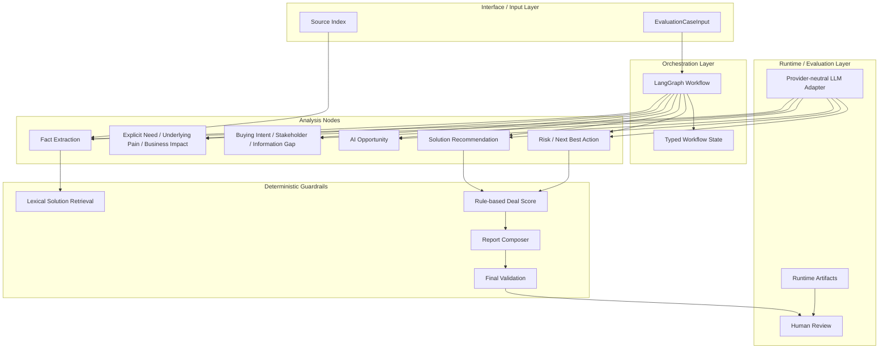
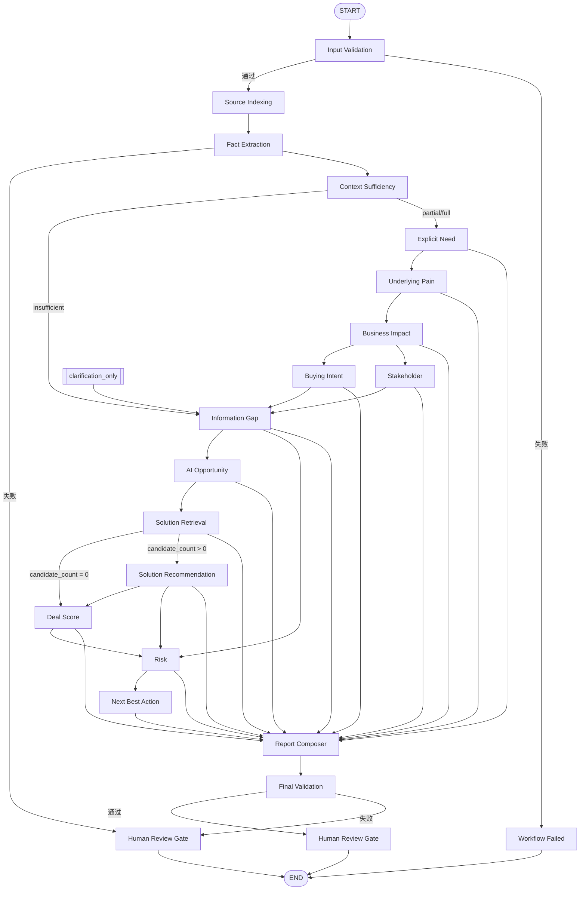

# System Architecture and Workflow V1

## 1. 文档目标

本文说明 Architecture C 的系统分层、工作流路径、纯代码 Guardrail、运行时留痕和 Human Review 边界，面向招聘展示和项目复现。

本文不逐文件解释实现细节，也不把它写成代码注释式清单。

## 2. 系统边界

Architecture C 解决的是企业销售洞察链路里的“可审计分析”问题，而不是自动销售执行系统。

本系统：

- 接受结构化案例输入
- 基于证据和合同做节点化分析
- 在纯代码节点处做确定性判断
- 在最终阶段进入 Human Review

本系统不做：

- 自动写 CRM
- 自动发邮件
- 自动下单
- 自动修复错误输出
- 自动重试失败节点
- 将 Hidden Reference Pack 直接暴露给运行时主流程

## 3. 整体分层架构

## 4. Architecture C 主 Workflow

### 路径说明

- 正常路径会走到 Report Composer，再进入 Final Validation，最后进入 Human Review
- `clarification_only` 会在信息不足时直接收敛到澄清与人工复核
- `candidate_count = 0` 时会跳过 Solution Recommendation
- 任何失败都不应伪造最终报告

## 5. LLM 节点与纯代码节点划分

### LLM 节点

- fact_extraction
- explicit_need
- underlying_pain
- business_impact
- buying_intent
- stakeholder
- information_gap
- ai_opportunity
- solution_recommendation
- risk
- next_best_action

### 纯代码节点

- input_validation
- source_indexing
- context_sufficiency
- solution_retrieval
- deal_score
- report_composer
- final_validation
- human_review_gate

## 6. 数据与证据流

Architecture C 的数据流遵循“先证据，后推断，再行动”的顺序。

1. Input Validation 确认结构化输入可处理
2. Source Indexing 建立证据索引
3. Fact Extraction 从输入中提取可引用事实
4. 后续节点只能围绕已经索引的证据和已确认事实展开
5. Information Gap、AI Opportunity、Risk 与 Next Best Action 只做受约束的业务推断
6. Report Composer 只组装已验证节点结果，不负责重新分析

这意味着：

- 事实提取不能直接跳成行动建议
- 推断不能冒充事实
- 方案建议不能越过候选边界
- 纯代码节点负责收口，而不是“帮模型圆场”

## 7. Guardrail 与失败路由

本项目主要处理的失败类别如下：

- API / Network Failure
- JSON Parse Failure
- Schema Validation Failure
- Evidence Reference Failure
- Cross-Node Business Rule Failure
- Candidate Boundary Failure
- Final Validation Failure

统一原则：

- 不自动修复
- 不自动重试
- 不把失败结果写成看似成功的最终报告
- 失败节点保留可审计诊断信息
- Human Review 作为最终出口

## 8. Runtime 与审计留痕

每次 Live Run 保存以下对象：

- `input_case.json`
- `workflow_state.json`
- `report_draft.json`
- `final_validation_result.json`
- `final_report.json`（存在时）
- `run_metadata.json`
- 各节点的 `llm_calls/` 记录

不存在的对象不创建伪文件。

这些运行产物存放在 `data/runtime` 下，并由 Git 忽略。

## 9. Human Review 边界

Human Review 不是“最后补锅”，而是系统设计的一部分。

它意味着：

- 机器负责把分析链路做对、做清楚、做可追踪
- 人负责最终确认是否进入真实销售动作

因此：

- 没有稳定 Final Report 就不假装成功
- 没有证据支撑就不伪装成事实
- 没有候选支持就不伪装成可推荐方案

## 10. 当前限制

- 真实模型尚未完成稳定端到端 Final Report
- 节点较多，Token 和延迟偏高
- 当前检索层是 lexical retrieval，不是向量 RAG
- 当前只围绕 3 个种子案例做重点实验
- 当前没有 UI、CRM 写入和自动外部操作
- 当前不做自动重试和自动修复

