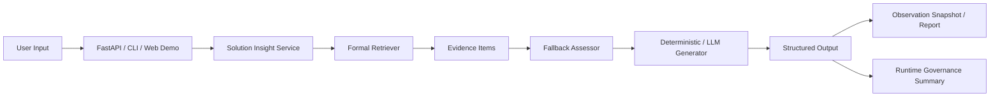
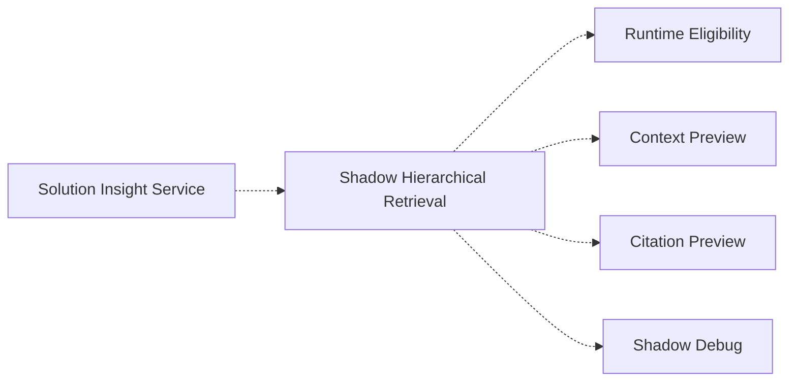
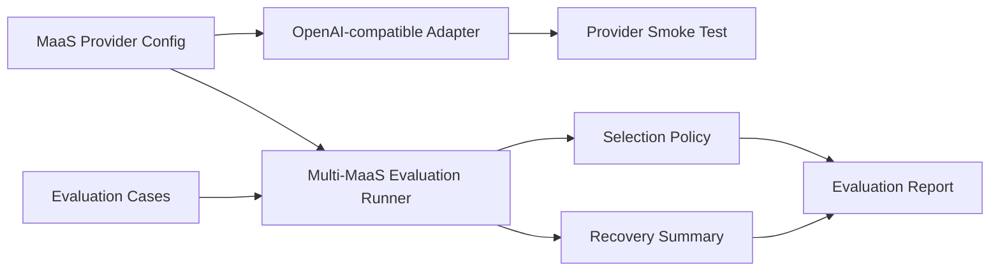

# Architecture Overview

## Overview

这个仓库的产品化路径可以分成两条：

1. 正式主链路：输入 -> 检索 -> 证据 -> fallback -> 结构化输出
2. Shadow 旁路：输入 -> hierarchical retrieval debug -> 仅供诊断
3. Web Demo 展示层：输入表单 -> `/solution-insight` -> 结果卡片，不改变 service / retrieval / evaluation 主链路
4. Runtime Governance v0.1：围绕主链路记录 trace、权限、评测、人审触发、fallback、成本估算和企业交付边界
5. Multi-MaaS Evaluation Layer v0.5：围绕 MaaS provider / model readiness 做 dry-run、smoke test、评测报告、selection recommendation 和 recovery summary，不影响正式回答主链路

可维护的 Mermaid 图源文件见 [architecture_diagram.mmd](architecture_diagram.mmd)。

## Main Flow

## Shadow Flow

## Multi-MaaS Evaluation Layer

This layer is an evaluation / governance layer:

- MaaS Provider Config lives in `config/maas_providers.yaml`.
- OpenAI-compatible Adapter provides an offline-safe adapter boundary.
- Provider Smoke Test validates structure, dry-run behavior, and missing-key handling.
- Multi-MaaS Evaluation Runner reads seed cases and provider targets.
- Selection Policy produces evaluation-only recommendations.
- Recovery Summary reports retry / fallback / human review / stop recommendations.
- Evaluation Report can be rendered as JSON / Markdown.

It does not affect the formal answer path. It does not execute production routing.

## Design Principles

### Formal path stays frozen

- 正式 retriever 的默认行为不变
- formal evidence 仍然来自同一套冻结结果和运行时过滤
- 任何 shadow / debug 都不应改写正式 answer

### Shadow is diagnostic only

- `HIERARCHICAL_RETRIEVAL_MODE=off` 时完全关闭
- `HIERARCHICAL_RETRIEVAL_MODE=shadow` 时只输出 debug
- shadow 不参与正式 response 的 evidence 选择

### Fallback protects the boundary

fallback 不是“失败就硬继续”，而是：

- 证据不足时提醒人工确认
- 检索错误时不伪造结论
- 边界不清时不冒充可信答案

### Governance is local-first

- `run_id` / `trace_id` 用于本地追踪
- permission / approval 当前是本地预设和模拟状态
- trajectory evaluation 是规则门，不是人工评分
- observability cost 是估算，不是生产账单
- human review queue 是触发队列，不代表已完成真实人工评审

## Why this architecture works for demos

- CLI 可以快速演示
- FastAPI 可以给出最小 HTTP 入口
- Web Demo 让面试或录屏时更容易展示结构化结果，不影响后端契约
- formal benchmark 结果仍然冻结可追溯
- shadow 让我们可以展示技术深度，但不会污染正式结论
- Observability Snapshot 位于正式输出之后，不影响主链路，只负责可展示、可排障的只读观测
- Runtime Governance v0.1 让 demo 能说明企业交付边界，但不声称已经具备生产级 IAM、不可变审计日志或真实企业写入
- Multi-MaaS Evaluation Layer v0.5 让 demo 能说明 MaaS provider readiness 和治理边界，但不声称真实 MaaS 接入、真实模型评测结果或生产路由
