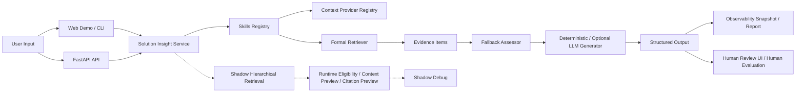

# Architecture Overview

## Overview

这个项目围绕一个轻量但完整的 Agent MVP 组织，核心目标是把“需求理解 -> 正式检索 -> 证据约束 -> fallback -> 结构化输出”串成一条可运行、可验证、可观察的主链路。

当前架构包含九个主要层次：

1. Web Demo Layer
2. API Layer
3. Agent Service
4. Skills Registry
5. Context Provider Registry
6. Retrieval Layer
7. Evaluation Layer
8. Observability Layer
9. Human Review Layer

Mermaid 图源文件见 [architecture_diagram.mmd](architecture_diagram.mmd)。

## End-to-End Flow

## 1. Web Demo Layer

Web Demo 提供一个最小交互式展示入口：

- 输入业务场景
- 触发 `/solution-insight`
- 以卡片展示结果、证据、fallback、enterprise context、skill trace 和 shadow debug

这一层只负责展示，不改写 API 契约。

## 2. API Layer

FastAPI 当前提供：

- `GET /health`
- `POST /solution-insight`
- `GET /demo`
- `GET /human-eval`

其中 `/solution-insight` 是正式结构化输出接口，`/demo` 和 `/human-eval` 是展示与评审入口。

## 3. Agent Service

`SolutionInsightService` 是当前 MVP 的主服务层，负责把：

- 用户请求
- 企业上下文
- 正式检索结果
- fallback 判断
- deterministic / optional LLM generation

整合成一份结构化输出。

## 4. Skills Registry

当前项目没有引入复杂外部 Agent 框架，而是使用轻量 Skills Registry 组织内部职责边界，例如：

- requirement understanding
- enterprise context
- formal retrieval
- shadow retrieval
- fallback assessment
- solution generation

这让 service 内部链路更清晰，也方便保留 `skill_trace`。

## 5. Context Provider Registry

Context Provider Interface 负责统一接入：

- company profile
- CRM context
- ticket context
- BI context
- knowledge context

当前实现仍然是本地 mock / fixture，不依赖真实企业系统。

## 6. Retrieval Layer

Retrieval Layer 分成两条：

### Formal Retrieval

- 使用当前冻结的正式 retriever
- 输出正式 evidence
- 保持 formal benchmark 契约不变

### Shadow Hierarchical Retrieval

- 只在 `HIERARCHICAL_RETRIEVAL_MODE=shadow` 或显式启用时运行
- 只进入 debug
- 不影响正式 evidence
- 不改写正式 prompt

## 7. Evaluation Layer

当前评测层包括：

- Formal Retrieval Benchmark v2
- Retrieval failure diagnosis
- LLM evaluation harness
- Human evaluation packet and summary

这些结果用于帮助判断系统边界，而不是替代运行时契约。

## 8. Observability Layer

Observability Layer 负责把单次运行中的：

- formal retrieval status
- shadow retrieval status
- provider trace
- skill trace
- fallback reasons

整理为 snapshot 和 Markdown report，方便本地调试、录屏和问题复盘。

## 9. Human Review Layer

Human Review Layer 提供轻量人工复核入口，用于：

- 浏览 case
- 查看结构化输出
- 给出人工判断
- 汇总 review 进度

它不替代正式评测，而是补充“人工确认”链路。

## Design Principles

### Formal path stays frozen

- 正式 retriever 默认行为不变
- 正式 evidence 只来自 formal retriever
- shadow 和 debug 不应污染正式答案

### Shadow is diagnostic only

- `off` 时完全关闭
- `shadow` 时只输出诊断信息
- 不参与正式 evidence 选择

### Fallback protects the boundary

fallback 的目标不是“继续硬答”，而是：

- 证据不足时提醒人工确认
- 检索或生成异常时保留风险信息
- 边界不清时避免伪造可信结论

### Local-first MVP

这个仓库优先保证：

- 本地可运行
- 结果可复现
- 链路可观察
- 边界可解释

而不是优先做复杂前端、多租户或生产平台化能力。
