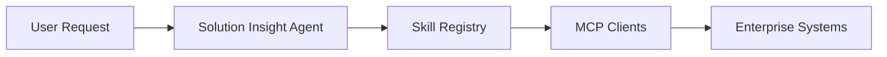

# MCP Extension Design

## Why MCP is not hard-wired today

当前项目没有硬接 MCP，不是因为 MCP 不重要，而是因为它对这个阶段的 demo 价值并不高。

主要原因有三个：

- 当前没有真实 CRM、工单、BI 或企业知识库后台系统
- 当前重点是先完成 Agent service 闭环和评测框架
- 过早引入 MCP 会明显增加复杂度，但不会提升当前公开 demo 的可信度

也就是说，现在最重要的是把：

- retrieval
- fallback
- structured output
- human confirmation

这些核心链路讲清楚，而不是为了“看起来像企业系统”去接一堆并不存在的后端。

## What MCP could enable in the future

如果这个项目进入真实企业环境，MCP 扩展会很有价值。

### CRM MCP Server

可提供能力：

- 读取客户基本信息
- 读取商机阶段
- 读取历史拜访记录
- 获取联系人与账户上下文

对 Agent 的意义：

- 补充用户输入上下文
- 降低需求理解阶段的信息缺失

### Ticket MCP Server

可提供能力：

- 读取服务工单
- 查看升级记录
- 统计重复问题和 SLA 风险

对 Agent 的意义：

- 更准确识别 pain point
- 给方案建议提供真实运营侧证据

### Knowledge Base MCP Server

可提供能力：

- 连接真实企业知识库
- 提供最新产品文档、FAQ、案例和交付约束

对 Agent 的意义：

- 用真实知识库替代公开合成 demo 知识库
- 让 formal retrieval 更接近实际业务环境

### BI / Analytics MCP Server

可提供能力：

- 拉取漏斗转化率
- 客户分层指标
- 服务效率指标
- 运营表现报表

对 Agent 的意义：

- 让“业务痛点”和“AI 机会点”更有量化上下文
- 降低纯文本推断的主观性

### Calendar / Email MCP Server

可提供能力：

- 拉取会议记录
- 同步下一步行动
- 生成待确认事项

对 Agent 的意义：

- 把 insight 输出与真实协作动作接起来
- 让 human confirmation 进入实际工作流

## Future architecture direction

未来如果引入 MCP，更合理的架构会是：

可以进一步展开成：

- `User Request`
- `Solution Insight Agent`
- `Skill Registry`
- `CRM MCP Server`
- `Ticket MCP Server`
- `Knowledge Base MCP Server`
- `BI / Analytics MCP Server`
- `Calendar / Email MCP Server`

## Design principle

未来引入 MCP 时，仍然建议保留当前项目已经建立的几条原则：

- formal path 和 experimental path 分离
- retrieval 和 generation 不混淆
- evidence and fallback first
- external tools do not bypass guardrails

## Conclusion

当前不硬接 MCP，是一个刻意的范围控制，而不是能力缺失。

对这个项目来说，更合理的顺序是：

1. 先把 Agent service、retrieval、fallback 和评测讲清楚
2. 再引入 Skill Registry
3. 最后才接入真实企业 MCP 系统

这样做更符合一个作品集项目从“可信原型”走向“企业集成”的自然路径。
