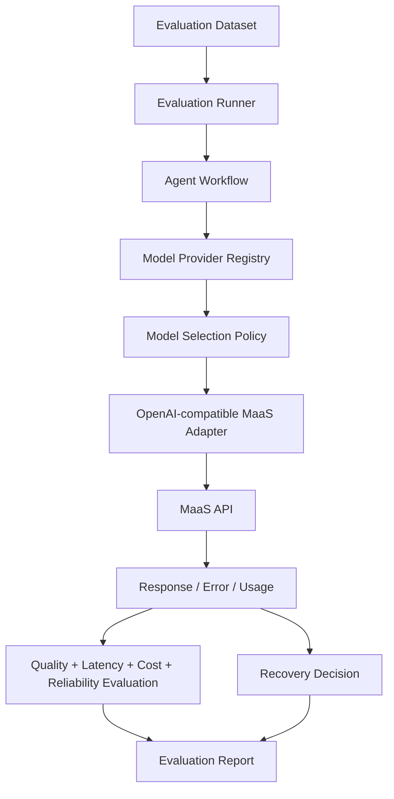

# Multi-MaaS Evaluation Foundation Plan

## 1. Background

The repository already has a local-first model provider abstraction, fallback and recovery taxonomy, run observability, cost estimation, trajectory evaluation, human review triggers, and an LLM evaluation harness. These pieces are enough to plan a Multi-MaaS Evaluation Foundation without changing the production agent chain or calling real model APIs in this batch.

The next step is to move from a single deterministic or mock provider view toward a controlled, offline-testable foundation for comparing multiple OpenAI-compatible MaaS providers. This should support provider smoke tests, model/provider comparison reports, recovery recommendations, and governance documentation while preserving the deterministic baseline and keeping real API calls explicitly opt-in.

## 2. Current Repository Readiness

| Area | Existing Module | Current Capability | Reuse Decision | Notes |
| --- | --- | --- | --- | --- |
| Model Provider | `agent/model_providers/base.py`, `agent/model_providers/mock.py`, `agent/model_providers/registry.py` | `BaseModelProvider` defines provider/model metadata, capability flags, `health_check()`, `generate()`, and `estimate_cost()`. `MockModelProvider` returns deterministic JSON or simulates `model_timeout`, `model_schema_invalid`, and `model_unavailable`. `ModelProviderRegistry` supports register/get/list, healthy primary selection, fallback selection, and health checks. | Reuse and extend | Add an OpenAI-compatible adapter behind this abstraction. Do not create a parallel provider system. |
| Recovery | `agent/recovery/models.py`, `agent/recovery/decision.py` | Error taxonomy covers model, tool, permission, retrieval, evaluation, human review, runtime, and unknown categories. `RecoveryDecisionEngine` returns retry/fallback/human_review/stop/continue/compensate recommendations. | Reuse and extend | It recommends decisions only; it does not execute retries, live routing, or compensation. |
| Retry Policy | `agent/recovery/policy.py`, `config/recovery_policies.yaml` | Loads local YAML with `max_retry_count`, retryable error types, non-retryable error types, `backoff_strategy`, and `fallback_after_retries`. Current retryable errors include `model_timeout`, `model_unavailable`, and `tool_timeout`. | Reuse | Future MaaS evaluation can feed provider errors into this policy and report recommended actions. |
| Fallback Taxonomy | `agent/recovery/models.py`, `docs/FALLBACK_AND_RECOVERY.md` | Defines `retrieval_fallback`, `model_fallback`, `tool_fallback`, `workflow_fallback`, `human_fallback`, and `safe_response_fallback`. | Reuse | Provider fallback simulation should map to `model_fallback`, not create a new fallback taxonomy. |
| Observability | `agent/observability/models.py`, `agent/observability/metrics.py`, `agent/observability/snapshot.py` | Captures run IDs, trace IDs, event counts, model/tool/permission/fallback/human-review counts, total latency, and recovery summaries. | Reuse and extend | `RunMetrics` does not yet expose provider/model as first-class fields; provider/model dimensions should be added to evaluation reports first. |
| Cost Tracking | `agent/observability/cost_tracker.py`, `config/model_costs.yaml` | Estimates token counts and estimated costs from local policies. Unknown providers return warnings instead of crashing. | Reuse and extend | Estimated cost is not billing. MaaS costs should remain optional and clearly estimated or unavailable. |
| LLM Evaluation | `evaluation/llm/*`, `scripts/run_solution_insight_llm_eval.py` | Deterministic baseline evaluation is frozen. Provider comparison models already include provider statuses, skipped providers, case errors, latency summaries, and usage/cost summaries. | Reuse and extend | Current enabled baseline is deterministic. Live comparison exists as optional harness logic and must remain opt-in. |
| Trajectory Evaluation | `evaluation/trajectory/*`, `config/trajectory_evaluation_rules.yaml` | Rule-based gate supports `pass`, `retry`, `human_review`, and `stop`; rules cover policy stop, permission denial, high risk review, fallback explanation, event consistency, excessive failures, required core nodes, and shadow/formal boundaries. | Reuse | Use for governance signals and human-review trigger rates; do not write human evaluation scores. |
| Reports | `reports/latest_run_summary.json`, `reports/latest_cost_summary.md`, `scripts/generate_run_summary_report.py` | Current report directory holds latest local run summary JSON and estimated cost Markdown. | Reuse with new report names | Suitable for MaaS smoke and model comparison outputs if mock/skipped/live reports are separated from frozen artifacts. |
| Config | `config/model_providers.yaml`, `config/recovery_policies.yaml`, `config/model_costs.yaml` | Model provider config includes deterministic and mock providers plus a DeepSeek placeholder. Recovery config is local and deterministic. | Reuse and extend | Add `config/maas_providers.yaml` later. Do not overload existing config with unverified MaaS claims. |

Additional readiness notes:

- `BaseModelProvider` currently supports `provider_name`, `model_name`, `supports_tool_calling`, `supports_structured_output`, `supports_long_context`, `supports_streaming`, `cost_profile`, `latency_profile`, `data_policy`, `health_check()`, `generate(prompt, **kwargs)`, and `estimate_cost(input_text, output_text)`.
- `MockModelProvider` can simulate normal deterministic output, timeout, invalid schema, and provider unavailable states.
- `ModelProviderRegistry` supports registration, lookup, primary selection, fallback selection, and health checks. It does not implement weighted routing, model scoring, traffic shifting, or production fallback execution.
- A named `ModelSelectionStrategy` does not exist in `agent/model_providers/`. There is node-level model routing in `agent/workflow_c/model_routing.py`, with primary/fallback model configs for selected Workflow C nodes, but that is not a general provider selection strategy.
- `RecoveryDecisionEngine` handles model timeout, model schema invalid, model unavailable through retry/fallback behavior, plus permission, retrieval, evaluation, runtime, high-risk tool, and unknown error paths.
- `CostTracker` and `RunMetrics` can support latency, estimated cost, token counts, fallback counts, and human review counts, but provider/model dimensions are only partially represented today.
- The LLM evaluation harness is suitable for multi-provider expansion because it already has provider statuses, skipped-missing-key handling, latency summaries, usage summaries, case errors, and aggregate scores by provider.
- Existing capabilities to reuse: provider protocol, mock provider, registry, recovery taxonomy, retry policy, trajectory evaluation, cost tracker, LLM eval scoring, report safety checks.
- Existing capabilities to extend: OpenAI-compatible adapter, MaaS provider config, provider/model dimensions in reports, smoke test skeleton, recovery recommendation mapping for provider errors.
- Capabilities not to duplicate: model provider abstraction, recovery decision system, fallback taxonomy, trajectory evaluation, human evaluation artifacts, deterministic baseline artifacts, and existing benchmark result storage.

## 3. Target Capability

The v0.5 target is a Multi-MaaS Evaluation Foundation with:

- OpenAI-compatible MaaS Adapter
- MaaS Provider Config
- Provider Smoke Test
- Multi-MaaS Model Evaluation Runner
- Model / Provider Comparison Report
- Recovery Decision Integration
- Provider Selection and Fallback Simulation
- Multi-MaaS Governance Documentation

These capabilities should operate in evaluation mode first. They should not become production model routing by default.

## 4. Non-goals

- No real production model routing.
- No real automatic degradation.
- No real compensation execution.
- No real billing system.
- No multi-tenancy.
- No Kubernetes.
- No complex dashboard.
- No real CRM or ticket writes.
- No attempt to integrate every MaaS platform at once.
- No treatment of skipped, mock, or estimated results as real model evaluation results.

## 5. Proposed Architecture



In offline test mode, the adapter should be replaced by mock clients or skipped provider statuses. In live smoke mode, real calls must require explicit API key environment variables and explicit command flags.

## 6. Proposed New Files

The v0.5A foundation implements the adapter, candidate config, smoke test script, onboarding doc, and offline adapter tests. The v0.5B foundation implements the offline Multi-MaaS evaluation runner, seed cases, reports, governance docs, and runner tests.

| File | Purpose | Depends On | Should Modify Existing Flow? |
| --- | --- | --- | --- |
| `agent/model_providers/openai_compatible.py` | Implement an OpenAI-compatible provider adapter that conforms to `BaseModelProvider`. | `agent/model_providers/base.py`, existing recovery taxonomy | No. Implemented as opt-in adapter foundation. |
| `config/maas_providers.yaml` | Define MaaS provider candidates, base URL, API key env var, model examples, enabled flag, and verification metadata. | Existing config loading patterns | No. Implemented separately from `config/model_providers.yaml`. |
| `scripts/run_maas_provider_smoke_test.py` | Run provider availability/smoke checks with skipped status when API keys are missing. | OpenAI-compatible adapter, recovery decisions | No. Implemented as a standalone script. |
| `scripts/run_multi_maas_model_eval.py` | Run evaluation cases across selected provider/model pairs and write JSON/Markdown comparison reports. | Multi-MaaS runner, provider adapter, report helpers | No. Implemented as an offline-safe CLI without changing deterministic baseline checks. |
| `docs/MAAS_PROVIDER_ONBOARDING.md` | Document how to add a provider safely, including env vars and verification boundaries. | This plan, provider config | No. Implemented as documentation only. |
| `docs/MODEL_EVALUATION_GOVERNANCE.md` | Define rules for separating live, mock, skipped, and estimated evaluation outputs. | LLM evaluation and trajectory evaluation docs | No. Implemented as documentation only. |
| `docs/MULTI_MAAS_EVALUATION_REPORT_TEMPLATE.md` | Define report sections for provider comparison, limitations, and recommended actions. | Reports directory conventions | No. Implemented as documentation only. |
| `tests/test_openai_compatible_maas_provider.py` | Offline tests for adapter config, skipped missing key behavior, parsing, usage, errors, and secret redaction. | Adapter and mock client factory | No. Implemented as tests only. |
| `tests/test_multi_maas_model_eval.py` | Offline tests for multi-provider eval statuses, schema validity, latency/cost summaries, and separated outputs. | Multi-MaaS eval runner | No. Implemented as tests only. |

## 7. Evaluation Metrics

| Metric | Definition | Source | Current Status |
| --- | --- | --- | --- |
| `schema_valid_rate` | Share of evaluated cases whose normalized response satisfies required schema. | `evaluation/llm/evaluator.py`, `schema_is_valid` | partially_implemented |
| `evidence_grounding_score` | Rule-based score for whether response claims are grounded in evidence. | `SolutionInsightEvalScores.evidence_grounding` | implemented |
| `answer_quality_score` | Aggregate or overall quality score for the response. | `SolutionInsightEvalScores.overall_score` | implemented |
| `latency_ms` | Per-call or per-case provider latency in milliseconds. | `SolutionInsightComparisonLatencySummary`, live provider response latency | partially_implemented |
| `usage_available_rate` | Share of provider calls that return prompt/completion/total token usage. | Provider response usage fields | planned |
| `estimated_cost_per_run` | Estimated cost per run or provider evaluation based on usage and local cost policy. | `CostTracker`, comparison cost summary | partially_implemented |
| `provider_error_rate` | Share of provider cases that fail with request, response, JSON, timeout, or availability errors. | `case_errors_by_provider`, provider statuses | partially_implemented |
| `timeout_rate` | Share of provider calls classified as timeout. | Provider errors mapped to `model_timeout` | designed_only |
| `retry_recommended_count` | Count of provider errors for which recovery policy recommends retry. | `RecoveryDecisionEngine` | partially_implemented |
| `fallback_recommended_count` | Count of provider errors for which recovery policy recommends model fallback. | `RecoveryDecisionEngine`, fallback counts | partially_implemented |
| `human_review_trigger_rate` | Share of cases or runs that trigger human review. | Trajectory evaluation, observability metrics | partially_implemented |
| `tool_calling_compatibility` | Whether a provider/model supports tool calling for target workflow needs. | Provider metadata | designed_only |
| `structured_output_compatibility` | Whether a provider/model can return structured JSON reliably. | Provider metadata plus schema results | partially_implemented |

## 8. Provider Candidate Matrix

The following candidates are planning entries only. None are verified by this batch.

| Provider | Adapter Type | Base URL Status | API Key Env | Model Examples | Verification Status | Notes |
| --- | --- | --- | --- | --- | --- | --- |
| CubexAI / Lifangyun MaaS | OpenAI-compatible candidate | Example base URL known as `https://ai.lifangyun.com`; path such as `/v1` is not assumed. | `CUBEXAI_API_KEY` | To be configured by user/provider docs | not_verified | Do not claim API path, pricing, latency, or availability until smoke tested. |
| SiliconFlow | OpenAI-compatible candidate | Planned config; exact base URL must come from user/provider docs. | `SILICONFLOW_API_KEY` | To be configured by user/provider docs | not_verified | Candidate only. No live result exists in this repository audit. |
| Aliyun Bailian | OpenAI-compatible candidate | Planned config; exact base URL must come from user/provider docs. | `ALIYUN_BAILIAN_API_KEY` | To be configured by user/provider docs | not_verified | Existing `qwen` eval provider spec uses DashScope compatible mode, but this is not a verified Bailian MaaS integration. |
| OpenRouter | OpenAI-compatible candidate | Planned config; exact base URL must come from user/provider docs. | `OPENROUTER_API_KEY` | To be configured by user/provider docs | not_verified | Candidate only. No price or availability claim. |
| Generic OpenAI-compatible Provider | OpenAI-compatible generic | User-provided base URL required. | `OPENAI_COMPATIBLE_API_KEY` | User-provided model id | not_verified | Useful for local adapter tests and onboarding unknown compatible providers. |

## 9. Risk and Boundary

- API keys must be read from environment variables only.
- If an API key is missing, the result must be `skipped_missing_api_key`.
- Real API calls must be disabled by default.
- Tests must pass offline.
- Real evaluation results must be stored separately from mock and skipped results.
- Estimated cost is not real billing.
- Provider fallback simulation is not production routing.
- MaaS platforms must not be described as production integrations until verified by explicit smoke/evaluation artifacts.
- No real API keys may be written into the project.
- Live errors should be redacted before report output.
- Existing formal evaluation, human evaluation, LLM baseline, and benchmark result artifacts must remain untouched unless a later batch explicitly scopes that work.

## 10. Implementation Roadmap

### v0.5A OpenAI-compatible MaaS Adapter Foundation

Goal:

Establish the OpenAI-compatible adapter, MaaS config, offline tests, and provider smoke test skeleton.

Acceptance:

No API key means skipped. With an API key and explicit live flag, smoke test can run. Deterministic baseline is unaffected.

### v0.5B Multi-MaaS Model Evaluation Runner

Goal:

Reuse the existing LLM Evaluation Harness to generate unified provider/model evaluation reports.

Acceptance:

Output JSON and Markdown. Distinguish `skipped`, `success`, and `failed`. Record latency, usage, estimated cost, and schema validity.

### v0.5C Provider Selection & Recovery Governance

Goal:

Connect timeout, invalid schema, provider unavailable, and related errors to `RecoveryDecisionEngine`, producing retry, fallback, human_review, or stop recommendations.

Acceptance:

Only evaluation-mode recommended actions are produced. No production automatic routing is executed.

Current foundation:

v0.5C adds evaluation-only selection policies, candidate ranking, provider selection recommendation, recovery recommendation summary, and governance documentation. These outputs explain evaluation results without executing retry, fallback, compensation, or production model routing.

## 11. Acceptance Commands

For this batch, because only this document is added, the required commands are:

```bash
git diff --check
git status --short
```

The following targeted tests are acceptable when runtime cost is reasonable:

```bash
./.venv/bin/python -m pytest tests/test_fallback_recovery_and_model_provider.py -q
./.venv/bin/python -m pytest tests/test_observability_and_cost.py -q
./.venv/bin/python -m pytest tests/test_trajectory_evaluation_and_human_review.py -q
```

## 12. Release Playbook and Checklist

v0.5 release documentation is organized in:

- `docs/MULTI_MAAS_EVALUATION_PLAYBOOK.md`
- `docs/MULTI_MAAS_V0_5_RELEASE_NOTES.md`
- `docs/MULTI_MAAS_V0_5_CHECKLIST.md`

These documents keep the same boundaries as this plan: offline-first, dry-run by default, evaluation-only selection, no real API calls by default, no production routing, no real billing claims, and no replacement of formal retrieval or human evaluation artifacts.
